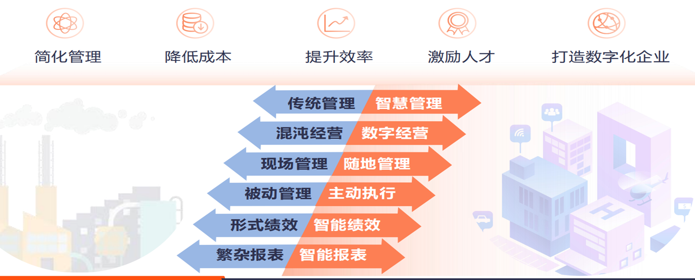
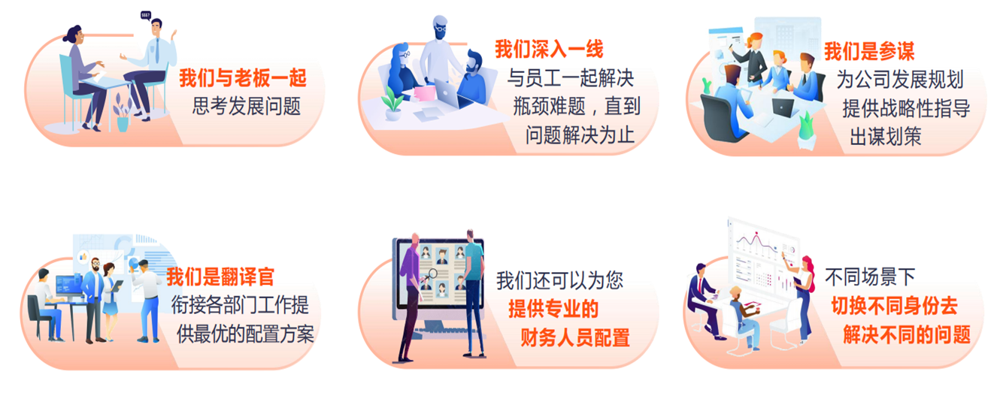
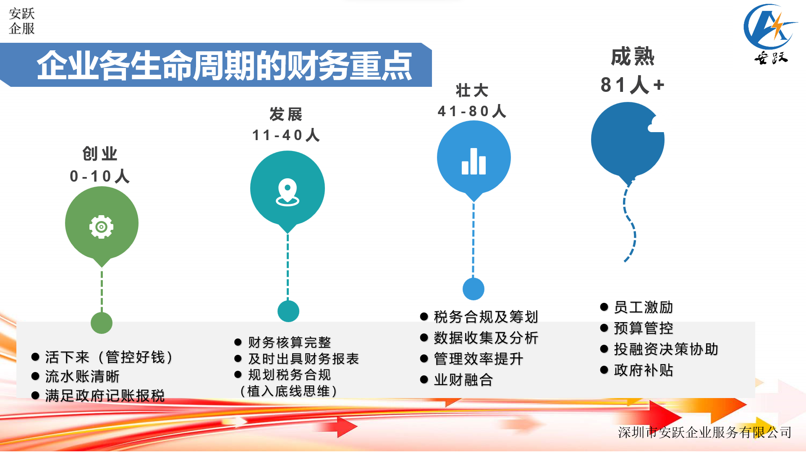
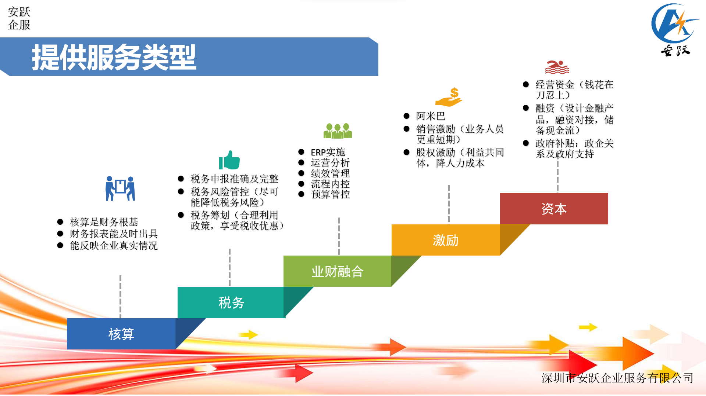
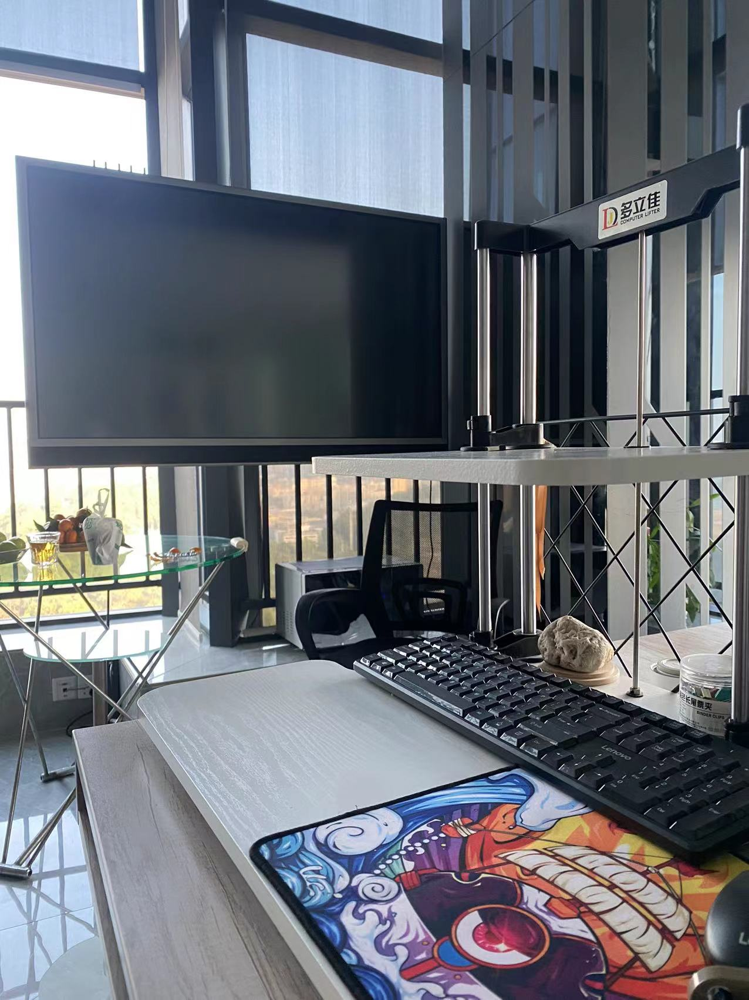
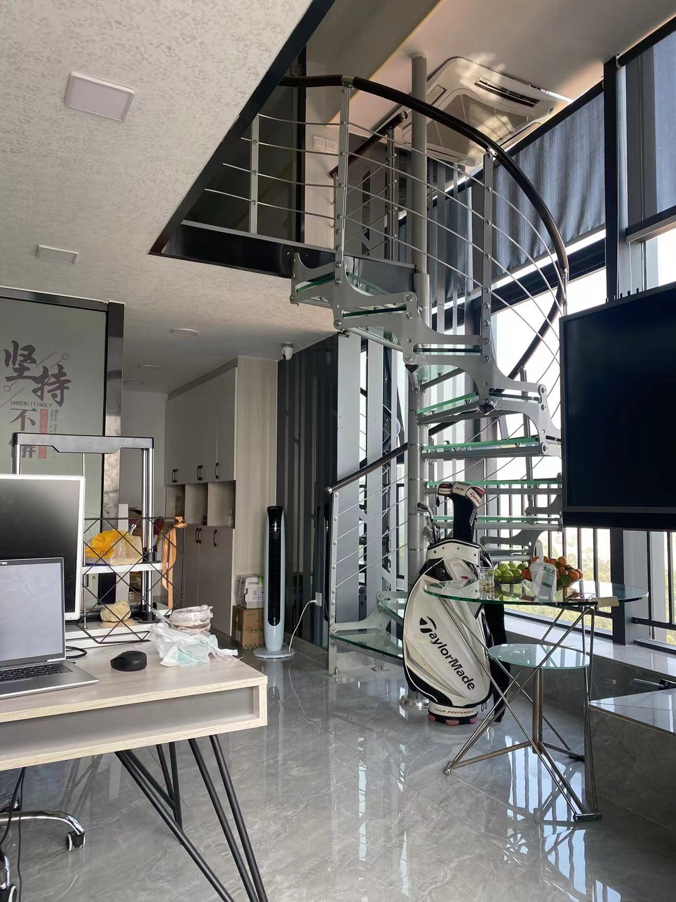
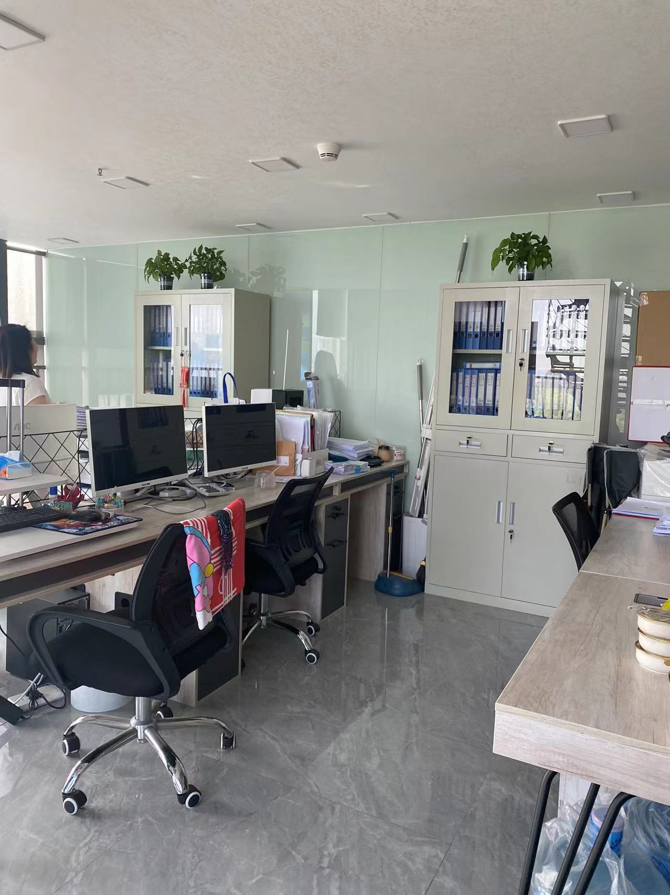

# 安跃企服

## 企业介绍

- 安跃企服是一家专注于 **规范企业财务** 的第三方服务企业

    > 以财务核算、业财融合、税务筹划、知识培训及团队激励为切入点，通过提供方案、跟进实施、培训等服务，解决中小微企业成长过程中各阶段的 **财税及管理效率** 问题。

- 顾问团队核心成员

    > 均具有本科及以上学历和 **高级会计师职称** ，**10年** 以上财务管理经验；在数据分析、业财融合、税务筹划等方面有深厚的实战经验和丰富的专业知识，擅长指导、控制、优化企业资源配置、管控企业风险。

## 创始人介绍

<!--  -->
<!--  -->

### 刘文群（Ann Liu）

- **高级会计师**
- **深圳市会计协会专家**
- **高评委委员**
- **20多年财务及管理工作经验**
- MBA

### 擅长领域

- 数据分析、成本控制、纳税筹划
- 业财融合、流程优化、运营决策
- ERP实施、预算管理、绩效管理

## 企业的优势

## 财税顾问角色

## 企业各生命周期的财务重点

## 提供服务类型

## 工作空间

